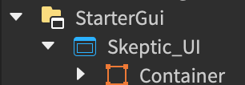

# Resources

## Overview

This module provides a variety of utility functions to interface with the server-side PlayerObject as well as commonly access Instances on the client-side.

## Properties

#### Player
```lua
Skeptic.Resources.Player: Player
```

A reference to `#!lua game:GetService("Players").LocalPlayer`.

#### GUI
```lua
Skeptic.Resources.GUI: Frame
```

A reference to `game > Players > [LocalPlayer] > PlayerGui > Skeptic_UI > Container`. This can be `nil` if being accessed very early after the player joins. 



!!! info
    This is the only layout that the framework will understand. This way, full intellisense is retained when accessing `Skeptic.Resources.GUI`.

!!! warning
    To be sure that this won't be `nil`, please use [`:WaitForGuiAsync()`](#waitforguiasync). In most cases, however, it is safe to assume this won't be nil.

#### Requester
```lua
Skeptic.Resources.Requester: Skeptic.Resources.Requester
```

_See: [Requester](Requester.md)_

A reference to the base Requester object. New Requesters must be created with this, using `#!lua Resources.Requester.new(...)`.

## Methods

#### WaitForGuiAsync
```lua
Skeptic.Resources:WaitForGuiAsync() -> Frame
```

Waits for then returns the player's container GUI frame. Times out after 16 seconds, but if a scenario like that ever occurs, then a missing frame will be the least of your problems.

#### WaitForServerAsync
```lua
Skeptic.Resources:WaitForServerAsync() -> serverLoaded: boolean, firstTime: boolean
```

Waits for the server-side PlayerObject to indicate that loading has finished. "serverLoaded" should always be true, and "firstTime" is true if, according to their player data, it is the player's first time playing that game.

In the catastrophic scenario that "serverLoaded" is false, then the method timed out after at least 76 seconds of giving the server a chance. This has yet to happen in a live game, but please make sure your PlayerHandlers don't yield infinitely.

#### PreloadAssets
```lua
Skeptic.Resources:PreloadAssets(
    callback: (asset: any, status: Enum.AssetFetchStatus, ratio: number) -> ()
)
```

Preloads assets in Instances with the "PreloadPriority" tag. See [CollectionService](https://create.roblox.com/docs/reference/engine/classes/CollectionService) for more on using tags in Roblox. Does not yield. The "callback" function will be called for each asset loaded, with the "ratio" argument indicating the ratio of completed assets (ie. 0.5 = 50%, 1 = 100% of assets loaded).

#### RequestAsync
```lua
Skeptic.Resources:RequestAsync(
    handlerName: string,
    targets: { Player }?
) -> any?
```

Asynchronously trigger a request for any PlayerHandler on the server. 

!!! warning
    The "targets" argument should not be used for newer work, and should be left as `nil`.